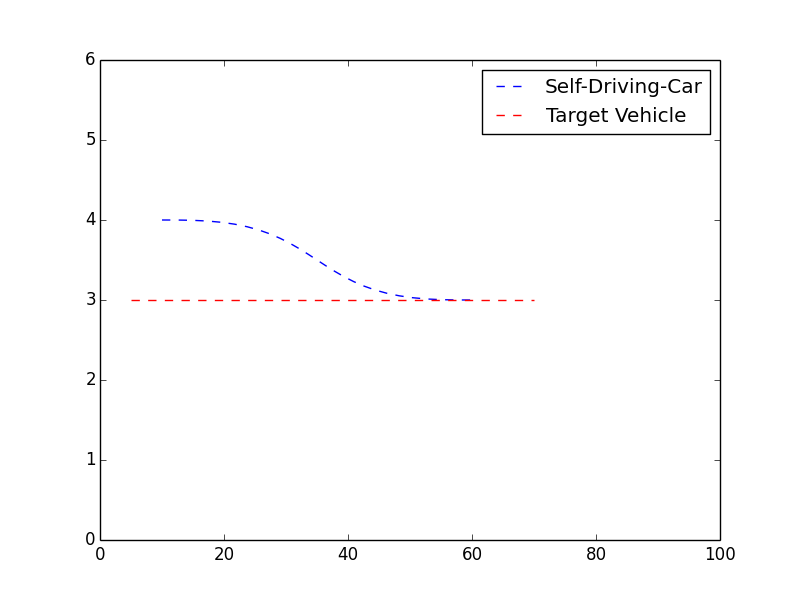

# jerk-minimizing-polynomial-trajectory-generation
Generates a jerk minimized polynomial trajectory for an autonomous vehicle to follow.

This plot shows the s (x-axis) and d(y-axis) trajectories followed by a vehicle in traffic (red) and a self driving car (blue). 

In above figure `self-driving car (blue color)` has been instructed to follow `target vehicle (red-color)` while staying 10 meters behind and as you can see it merges with same path as of target vehicle but stays behind.
